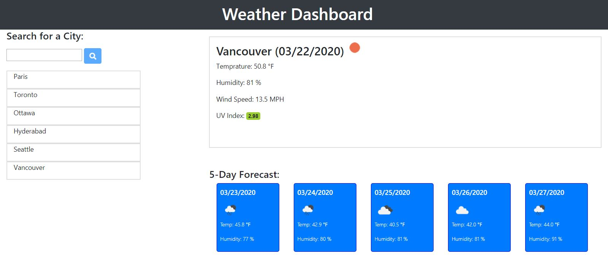
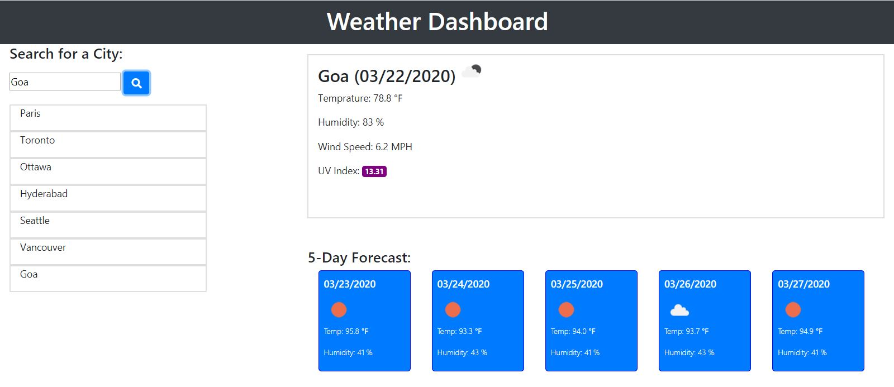
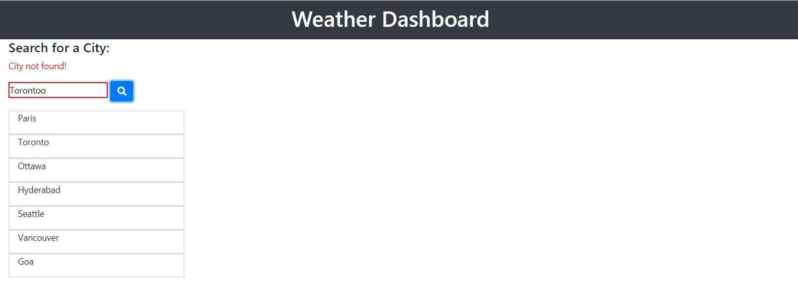

# weatherDashboard
A weather dashboard which lets user search for a city and displays current weather using openWeather api (https://openweathermap.org/api).
The searched cities are saved in local-storage of browser and displayed on the side-bar. User can also click on the city name in side bar to refresh the weather-data.
When the page loads, weather data is displayed for the last seacrhed cities from previous use.
The current weathe data also shows the UV-Index in color-coded way as described [here](https://en.wikipedia.org/wiki/Ultraviolet_index#Index_usage)
The project is deployed at - 
https://sandyboon.github.io/weatherDashboard/

Weather Dashboard

Color-coded UV Index -

When user searches for a wrong city name, they are shown an error - 

